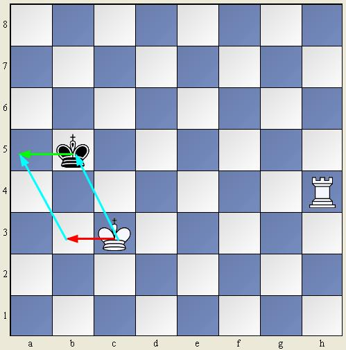
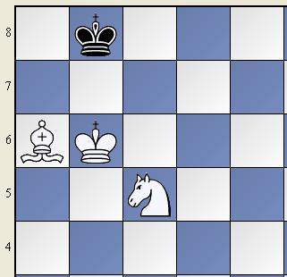

[TOC]

# 2021/05/03

## 棋子的价值

| 棋子   | 价值，最后一个数字是计算机分析 | 控制范围 |
| ------ | ------------------------------ | -------- |
| Queen  | $8-$10, $9.75                  | 21-27    |
| Rook   | $4-$6, $5                      | 14-14    |
| Bishop | $3-$3.5, $3.5                  | 7-13     |
| Knight | $3, $3.25                      | 2-8      |
| Pawn   | $1                             | 1-2      |
| King   | $1-$2.5 （攻击力）             | 3-8      |
|        |                                |          |

### 为什么要给棋子定价

国际象棋火力密度大，中盘主要是子力交换（兑子）过程，这时每方都要考虑兑子的输赢

### 规则

#### 王车易位

http://games.sports.cn/topicmatch/jc/gx/2010-04-08/1998567.html

### 参考

https://www.xqbase.com/other/compare2.htm

https://www.jianshu.com/p/7d3902ba5d03

http://games.sports.cn/topicmatch/jc/gx/2010-04-13/2000947.html

## 开局

### 为什么

棋盘开始时是固定的，所以可以有简单固定的走法

开局vs防御

### 棋谱的必要性

国际象棋大师==5-10万个棋谱

### 好和坏

什么是好，什么是坏

### 几种开局棋谱

意大利开局

后翼弃兵

拒后翼弃兵防御、接收后翼弃兵

斯拉夫防御

### 参考

https://zhuanlan.zhihu.com/p/142208740

## 课堂练习

一步杀。战术手册上：8，20

### 参考

国际象棋战术手册（上下册），简称战术手册

## 本周作业

战术手册题目：1-60

# 2021/05/10

## 术语-中英对照

Chess set       国际象棋棋具 
Colour          棋色 
White           白方    
Black           黑方 
Piece           棋子 

King         王 
Queen        后 
Rook         车 
Bishop       象 
Knight       马 
Pawn         兵 
Bishop of opposite colours异色格象 
Bishop of the same colours同色格象 
Bishop ending象残局 
Board              棋盘 
Square             方格 
Rank               横线 
File               直线 
Diagonal           斜线 
Centre             中心 
Wing               侧翼 
Check           将军 
Checkmate       将杀 
Mate            将杀 
Stalemate       无子可动 
Discovered check    闪将 
Double check        双将 
Perpetual check     长将 
To give check       打将 
Checkmate           将杀 
To give checkmate   杀王 
Exchange        交换、兑子 
Move            走子 
Capture         吃子 
Castling        王车易位 

Game                  对局 
Opening               开局 
Middlegame            中局 
Ending                残局 

Result                 战绩 
Win                    赢棋 
Loss                   负 
Draw                   和 
Resign                 认输 

Crosstable               成绩表   一般指循环制的成绩表 

Point                     分 
Half a point              半分 
Zero                      零 

Analysis                   拆棋 
Position                   局面 

Novelty                    新招 
Threat                     威胁 
Attack                     进攻 
Defence                    防御 

Variant                变着 
Combination            战术组合 
Sacrifice              弃子 
Mistake                错着 

Clock                     棋钟 
Flag                      钟旗 
Time                      时间 

Time trouble           时间恐慌 
Score sheet            记录纸 
Envelope               封棋信封 

Master                     大师 
Participant               参赛者 

Tournament             联赛 
Match                  对抗赛 
Olympaid               奥林匹克赛 
Team                   队 

Captain                    队长 
Country                    国家 
Winner                     优胜者 
Champion                   冠军 

Drawing of lots         抽签 
Number                  序号 
Round                   轮次 
To accept a draw    接受和棋 

Adjourned game      封局 
Adjourned position  封棋局面 

Advantage    n.      优势 
Decisive advantage   决定性优势 
Material advantage   子力优势 
Obvious advantage    明显优势 
Positional advantage 局面优势 

Development advantage   出子优势 
Space advantage         空间优势 
To get advantage        取得优势 
To have advantage       拥有优势 

Chief  arbiter           主裁判 
International  arbiter   国际裁判 
National  arbiter        国家裁判 

Bye 
To have the bye   轮空 

Game of chess    国际象棋对局 
Laws of chess    国际象棋规则 

Castle  v.      王车易位 
Long castling   长易位 
Short castling  短易位 

Centre  opening       中心开局 
Central  gambit       中心弃兵开局 
Bishops’ opening     飞象开局 
Latvian  gambit       拉脱维亚弃兵开局 

Kings’  gambit       王翼弃兵局 
Vienna  game          维也纳开局 
Phlidor’s  defence   菲立道尔防御 
Four  knights’  game          四马开局 
Italian  game                  意大利开局   
Evans  gambit                  伊文思弃兵局 
Two  knights’  defence        双马防御 
Scotch  game                   苏格兰开局 
Russian  defence               俄罗斯防御 
Spanish  game                  西班牙布局 

Caro-kann  defence       卡罗-康 防御 
Alekhine’s  defence     阿列亨防御 
French  defence          法兰西防御 
Sicilian  defence        西西里防御 
Queen’s  gambit         后翼弃兵局 
Queen’s  gambit  accepted   吃后翼弃兵局 
Slav  defence            斯拉夫防御 
Queen’s  indian  defence新印度防御 
Catalan  system          卡塔龙开局 
Kings  indian  defence   古印度防御 
English  opening         英国式开局

## 残局-Endgame

### 单后杀王-马步

注意最后在角落里，白王到位之前，要回退（back off），走大马步（三格），小马步就被逼和了

### 双车杀王-单向控制

### 单车杀王--单向控制-马步-对王

#### 对王

#### 马步

#### 单向控制-王当车用

## 参考

http://game.onegreen.net/world/List/List_1048.html

## 本周作业

练习以上今天学习的残局

# 2021/05/17

## 双象杀王

同样的基本原理，逼黑王到角落，然后双象黑白格各占一条斜线，白王辅助

### 参考

http://game.onegreen.net/world/HTML/151602.html

## 马象杀王

同样的基本原理，逼黑王到角落。

第一种三角形法则。
回忆之前的双象杀王，我们是利用屏障去把王推向角格的。实际上可以发现，黑王的活动范围也就是一个三角形。不过现在我们只有一个象，但还是可以有一个三角形的。至于这个网（已经不能算屏障了都是洞）上那些黑王能逃跑的缝隙，就要靠王和马了。

本身无兵残局想杀王这是最弱的子力了（视为象比马稍强），马有因为它奇怪的走法和短腿，是很难控制的。马象杀王呢，需要知道几个事项。
**1.如果对方的王在中心，正确无误的着法需要大约30步，而50步不动兵不吃子就算做和棋。**
**2.马象杀王的最后位置只有2个，在与自己的象所在格同色的角落。**比如你剩白格象就是a8格和h1格，剩黑格象就是a1和h8格。

### 参考

http://game.onegreen.net/world/HTML/151603.html

# 2021/05/x

## 胜与和

### 无力胜

双方都剩下一个单王；一方剩下一个单王，另一方剩下王和象（或马）；双方都剩下王和象（或马）

### 长将和棋

### 逼和

## 双马杀王-单王，王兵残局

### 参考

http://game.onegreen.net/world/HTML/151604.html

## 参考

http://game.onegreen.net/world/HTML/11173.html

# 2021/06/08

## 近三周在通过观察改进教学方法。发现的一些问题和提高水平的要点

- 第一个问题是孩子还不太会基本计算，走某个子不能预见到这一步的危险。这个是下棋的基本功，也是注意力的一种表现
- 第二个问题是不太会心算。就是在心中模拟走2-3步棋，然后计算其好坏。他们还通过在棋盘上摆棋来计算，但实际对弈中只能心算。一般认为，能计算的步数越多，棋力越高。这个问题是第一个问题的升级版，第一个问题相当于1步计算。
- 第三是如何让他们记住一些技巧。似乎给战术起个名字比较有效
- 第四是攻击性不足，比较喜欢躲避。需要鼓励进攻
- 准备启动软件辅助教学计划

